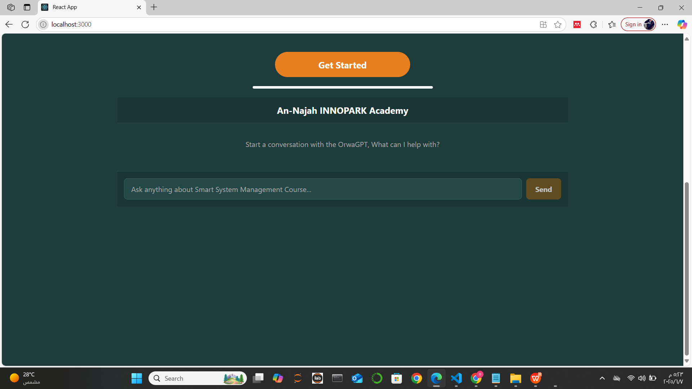
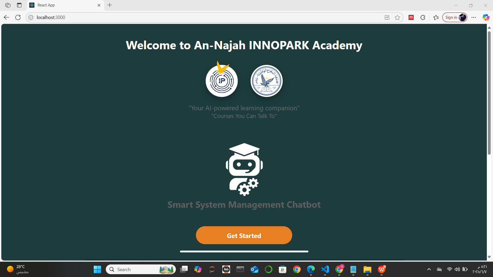
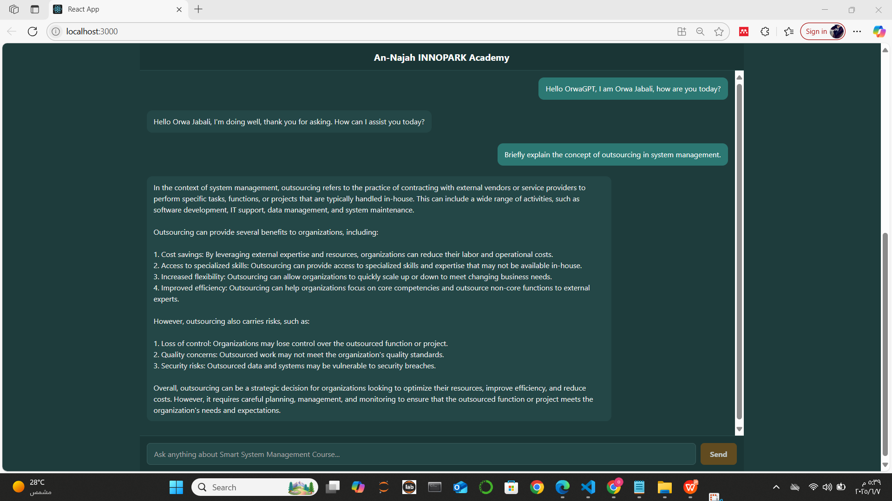
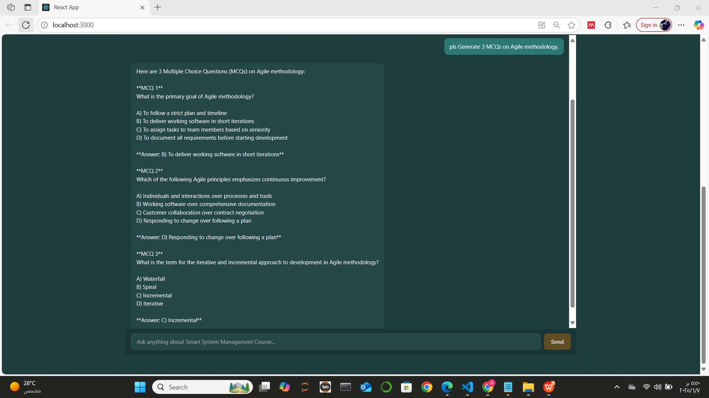
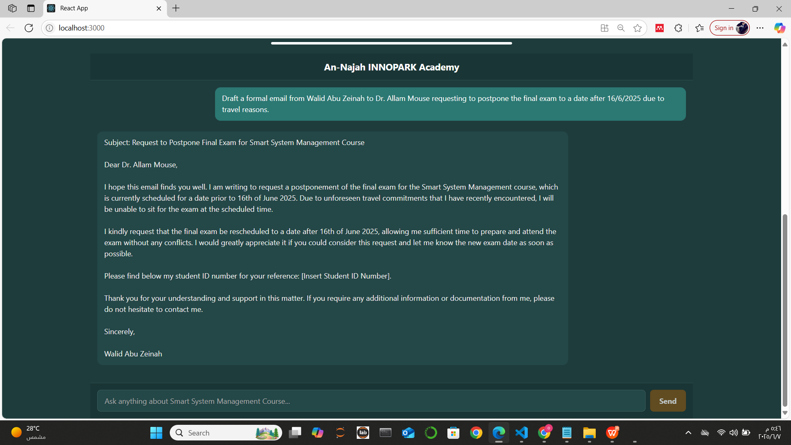
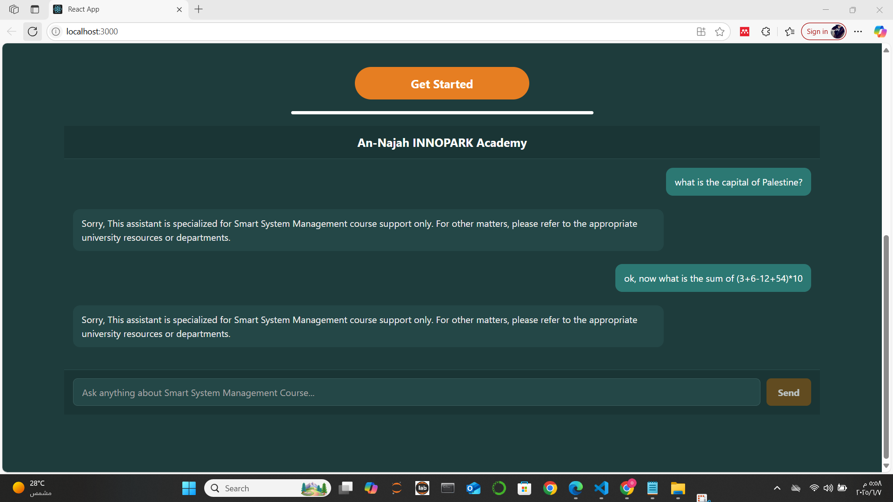
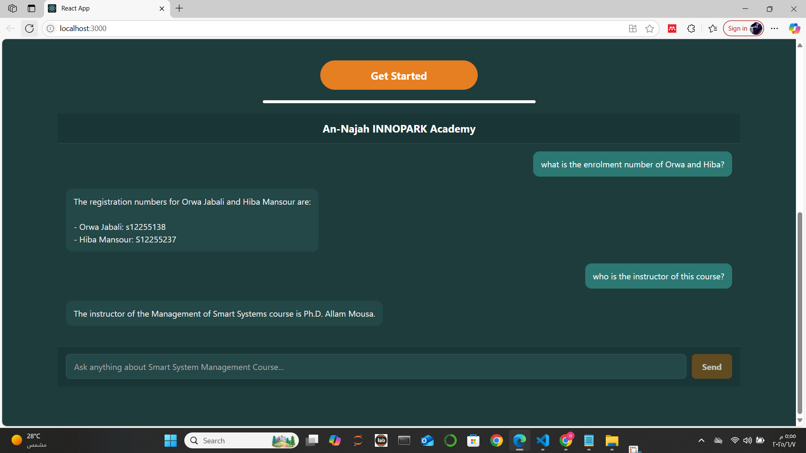

# Production-Grade Multi-Agent Chatbot with RAG & LLM Orchestration


A **production-ready AI assistant** built on a modular **multi-agent architecture**, combining **LLaMA 3.1 8B** (self-hosted on serverless GPU via RunPod/vLLM) with **Retrieval-Augmented Generation (RAG)** over a **Pinecone** vector database — all exposed through a **React/TypeScript** chat UI backed by a **Python/Flask** REST API.

---

## 📸 Screenshots

<table>
  <tr>
    <td align="center"><b>Welcome Screen</b></td>
    <td align="center"><b>Chat Interface</b></td>
  </tr>
  <tr>
    <td></td>
    <td></td>
  </tr>
  <tr>
    <td align="center"><b>Q&A Agent (RAG)</b></td>
    <td align="center"><b>Assessment Generator</b></td>
  </tr>
  <tr>
    <td></td>
    <td></td>
  </tr>
  <tr>
    <td align="center"><b>Email Agent</b></td>
    <td align="center"><b>Guard Agent (Query Filtering)</b></td>
  </tr>
  <tr>
    <td></td>
    <td></td>
  </tr>
  <tr>
    <td align="center" colspan="2"><b>Student Info Agent (Semantic Search)</b></td>
  </tr>
  <tr>
    <td colspan="2" align="center"></td>
  </tr>
</table>

---

## 🏗️ Architecture

The system routes every user message through a **pipeline of specialized agents**, each powered by LLaMA 3.1 8B over the OpenAI-compatible vLLM API:

```
                         ┌─────────────────────────────────────────┐
  React Frontend         │            Flask REST API                │
  (TypeScript)  ──POST──►│  /chat                                   │
                         │                                          │
                         │  1. Guard Agent        ◄── LLM call      │
                         │       │ (allowed?)                        │
                         │       ▼                                   │
                         │  2. Classification Agent ◄── LLM call    │
                         │       │ (intent routing)                  │
                         │       ▼                                   │
                         │  ┌────────────────────────────────┐      │
                         │  │      Task-Specific Agents       │      │
                         │  │                                 │      │
                         │  │  ❓ Q&A Agent ── Pinecone RAG   │      │
                         │  │  📝 Assessment Generator        │      │
                         │  │  📊 Submission Evaluator        │      │
                         │  │  🎓 Student Info ── Pinecone    │      │
                         │  │  📧 Email Response Agent        │      │
                         │  │  👋 Greeting Agent              │      │
                         │  └────────────────────────────────┘      │
                         └─────────────────────────────────────────┘
                                         │
                         ┌───────────────┴───────────────┐
                         │                               │
                   RunPod vLLM                      Pinecone
              (LLaMA 3.1 8B Instruct)          (Vector DB, 384-dim,
               Serverless GPU endpoint          cosine similarity RAG)
```

---

## 🤖 Agents

| Agent | Responsibility | LLM | Vector DB |
|-------|---------------|-----|-----------|
| **Guard Agent** | Binary classification — filters off-topic or harmful input | ✅ | ❌ |
| **Classification Agent** | Intent detection — zero-shot routing to the right specialist | ✅ | ❌ |
| **Q&A Agent** | RAG-powered question answering over indexed documents | ✅ | ✅ Retrieval |
| **Assessment Generator** | Generates MCQs, essays, project prompts, quizzes | ✅ | ❌ |
| **Submission Evaluator** | Grades uploaded submissions against rubric & reference materials | ✅ | ❌ |
| **Student Info Agent** | Semantic search over structured enrollment data | ✅ | ✅ Retrieval |
| **Email Response Agent** | Drafts formal emails with context-aware professional tone | ✅ | ❌ |
| **Greeting Agent** | Handles conversational openers and small talk | ✅ | ❌ |

---

## 🛠️ Tech Stack

### Backend
| Layer | Technology |
|-------|-----------|
| Language | Python 3.11 |
| Web Framework | Flask 3.x + Flask-CORS |
| LLM Inference | Meta LLaMA 3.1 8B Instruct — served via [vLLM](https://github.com/vllm-project/vllm) on RunPod Serverless GPU |
| LLM Client | OpenAI Python SDK (OpenAI-compatible API) |
| Vector Database | Pinecone Serverless (384-dim embeddings, cosine similarity) |
| RAG Indexing | Custom chunking pipeline (PyPDF2 + LangChain splitter) |
| PDF Processing | PyPDF2 — real-time text extraction from uploaded submissions |
| Config | python-dotenv |

### Frontend
| Layer | Technology |
|-------|-----------|
| Framework | React 19 + TypeScript 4.9 |
| Build Tool | Create React App / react-scripts |
| Features | Real-time chat UI, drag-and-drop file upload, loading states |
| Styling | Custom CSS (dark theme, responsive layout) |

### Infrastructure
| Component | Details |
|-----------|---------|
| LLM Runtime | RunPod Serverless — NVIDIA A5000 24 GB / Blackwell 96 GB |
| LLM Container | `runpod/worker-v1-vllm:v2.5.0stable-cuda12.1.0` |
| Vector DB | Pinecone Serverless — AWS us-east-1 |
| API Server | Flask dev server → production: Gunicorn/WSGI |

---

## 📂 Project Structure

```
├── python_code/
│   ├── api/
│   │   ├── main.py                     # Flask app — /chat endpoint
│   │   ├── agent_controller.py         # Orchestrator: Guard → Classify → Execute
│   │   ├── requirements.txt
│   │   ├── Dockerfile
│   │   └── agents/
│   │       ├── guard_agent.py
│   │       ├── classification_agent.py
│   │       ├── QAcourse_agent.py       # RAG: embed query → Pinecone → LLM
│   │       ├── assessment_generator_agent.py
│   │       ├── submission_evaluator_agent.py
│   │       ├── student_info_agent.py
│   │       ├── email_response_agent.py
│   │       ├── greeting_agent.py
│   │       └── utils.py               # get_chatbot_response(), get_embedding()
│   │
│   └── build_vector_database.ipynb    # Index documents into Pinecone
│
├── chatbot-frontend/
│   ├── src/
│   │   ├── App.tsx                     # Chat component + API integration
│   │   └── App.css
│   └── package.json
│
├── Screen_Shots_chatbot/              # UI screenshots
├── .env.example                       # Environment variable template
└── README.md
```

---

## ⚙️ Setup & Run

### Prerequisites
- Python 3.11+, Node.js 18+
- [RunPod](https://runpod.io) account — deploy a vLLM serverless endpoint with `meta-llama/Llama-3.1-8B-Instruct`
- [Pinecone](https://pinecone.io) account — create a serverless index (384-dim, cosine)
- HuggingFace token with Llama 3.1 access

### 1. Clone & configure
```bash
git clone https://github.com/your-username/orwagpt.git
cd orwagpt

# Backend environment
cp python_code/api/.env.example python_code/api/.env
# Fill in: PINECONE_API_KEY, RUNPOD_TOKEN, RUNPOD_CHATBOT_URL, RUNPOD_EMBEDDING_URL, MODEL_NAME
```

### 2. Start the backend
```bash
cd python_code/api
python -m venv .venv && .venv\Scripts\activate   # Windows
pip install -r requirements.txt
python main.py                                    # Runs on :8080
```

### 3. Index your documents into Pinecone
```bash
# Put your documents in python_code/data/
jupyter notebook python_code/build_vector_database.ipynb
```

### 4. Start the frontend
```bash
cd chatbot-frontend
npm install && npm start     # Opens on :3000
```

---

## 🔑 Environment Variables

```env
# python_code/api/.env

PINECONE_API_KEY=            # Pinecone API key
PINECONE_INDEX_NAME=         # Your index name (384-dim cosine)

RUNPOD_TOKEN=                # RunPod API token
RUNPOD_CHATBOT_URL=          # https://api.runpod.ai/v2/{endpoint_id}/openai/v1
RUNPOD_EMBEDDING_URL=        # https://api.runpod.ai/v2/{embedding_endpoint_id}/openai/v1
MODEL_NAME=                  # meta-llama/Llama-3.1-8B-Instruct
```

---

## 🔬 RAG Pipeline

```
Documents (PDF, PPTX, TXT)
        │
        ▼ Chunking (RecursiveCharacterTextSplitter)
        │
        ▼ Embedding (384-dim via vLLM embedding endpoint)
        │
        ▼ Upsert → Pinecone Index
        
At inference time:
        User query → embed → Pinecone top-K search → inject context → LLaMA 3.1 generation
```

This grounds LLM responses in your actual documents — preventing hallucinations and ensuring factual, domain-specific answers.

---

## 🔒 Security Design

- **Guard Agent** as first layer: every request is validated before reaching any specialist agent
- **No credentials in source code** — all secrets via `.env` (excluded from repo)
- **Input sanitization** at the API boundary
- Modular agents mean any agent can be updated or disabled without impacting others

---

## 🚀 Key Engineering Highlights

- **Serverless LLM inference** — zero idle cost, auto-scales with load via RunPod GPU workers
- **OpenAI-compatible API** — LLM backend is swappable (GPT-4, Mistral, Qwen, etc.) with zero code change
- **Dynamic agent routing** — adding new agents requires only registering them in `agent_controller.py`
- **File upload pipeline** — PDF/DOCX/TXT submissions are parsed in-memory and injected into the LLM context
- **Dual-index RAG** — separate Pinecone namespaces for structured data (entities) vs. unstructured documents

---

## 👤 Author

**Orwa Jabali**  
AI Engineer  
📧 orwajabali89@gmail.com  
🔗 [LinkedIn](https://www.linkedin.com/in/orwa-jabali-06259130a) &nbsp;|&nbsp; [GitHub](https://github.com/orwajabali)
